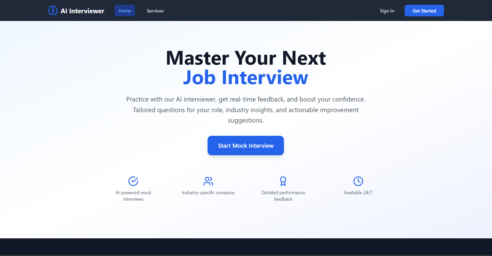
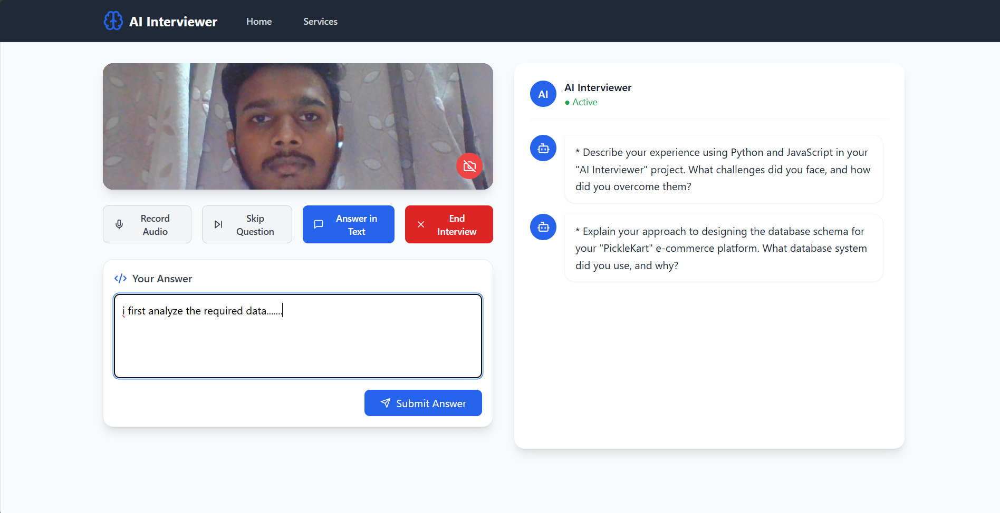
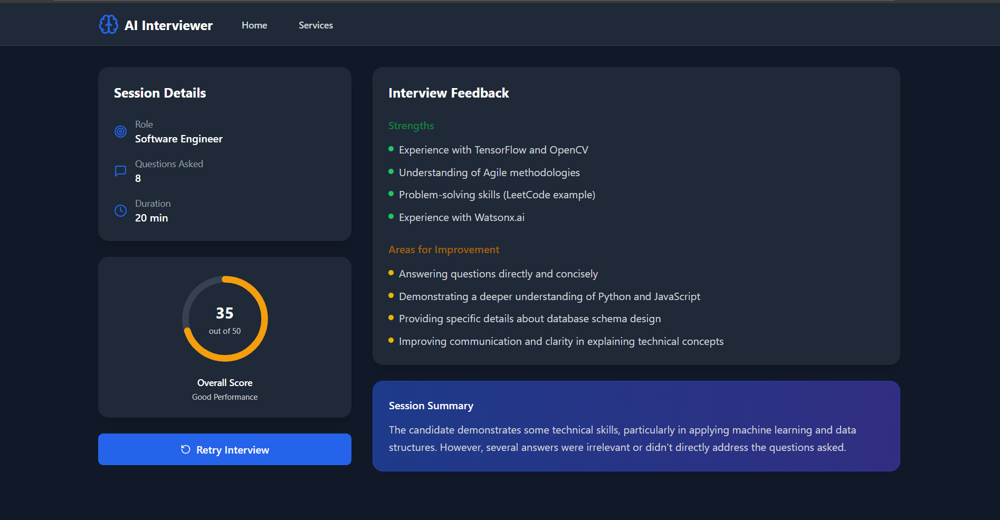
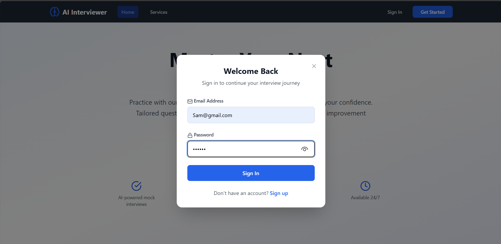
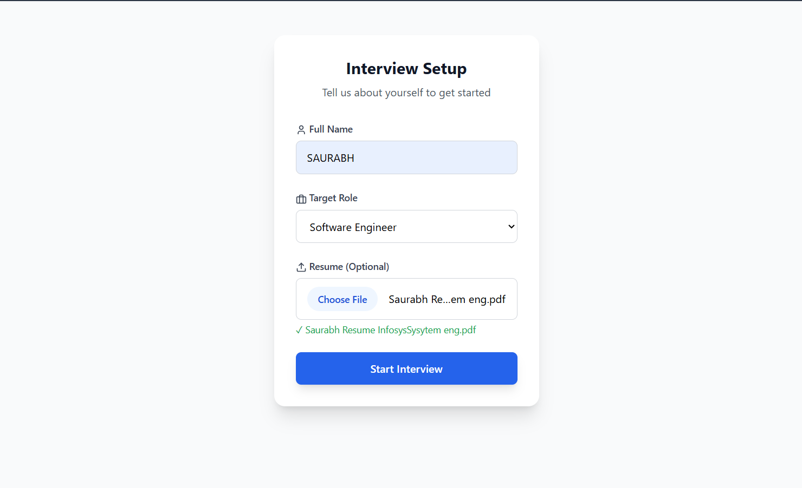

# 🎤 AI Interviewer  

An AI-powered interviewer platform that simulates real interview sessions.  
It asks candidates questions, records their answers (text/audio), evaluates their performance using LLMs (Gemini), and provides a final score with feedback.  

---

## 🚀 Features  

- **Candidate Flow**  
  - Fill form with name, role, resume.  
  - Start interview (AI asks questions).  
  - Answer in text **or record audio** (transcribed using Whisper).  
  - Skip questions or end interview anytime.  
  - Final **Evaluation Page** shows score, duration, and feedback.  

- **AI Evaluation**  
  - Uses **Gemini API** for scoring.  
  - Gives strengths, weaknesses, and areas for improvement.  
  - Evaluation is cached — no repeated API calls.  

- **Video & Audio Integration**  
  - Camera preview starts when interview begins.  
  - Microphone for audio recording (only during answer submission).  
  - Camera & mic automatically stop when session ends.  

---

## Project Screenshots

### Main Dashboard


### Interview Session


### Feedback Report


### login and session setup form





## 🛠️ Tech Stack  

### Frontend  
- React + Vite  
- Tailwind CSS + Framer Motion  
- Context API for session management  
- Lucide React for icons  

### Backend  
- FastAPI  
- MongoDB (Sessions, Answers, Scores)  
- Whisper (audio transcription)  
- Gemini API (evaluation/scoring)  

---

## 📂 Project Structure  

```bash
frontend/
  ├── src/
  │   ├── components/   # UI components (Navigation, ChatBubble, etc.)
  │   ├── context/      # SessionContext
  │   ├── pages/        # InterviewPage, EvaluationPage, HomePage
  │   └── services/     # API services (interview.js)

backend/
  ├── app/
  │   ├── api/v1/       # Routes (interview endpoints)
  │   ├── db/           # CRUD ops (sessions, answers)
  │   ├── services/     # scoring, audio_handler, audio_answer
  │   └── core/         # config, settings
```

## ⚙️ Setup  

### Backend  

Clone the repo and create a virtual environment:  

```bash
cd backend
python -m venv venv
source venv/bin/activate  # On Windows: venv\Scripts\activate
```

### Install dependencies:
```bash
pip install -r requirements.txt
```
### Start FastAPI server:
```bash
uvicorn app.main:app --reload
```

# Frontend

### Install dependencies:
```bash
cd frontend
npm install
```

### Start dev server:
```bash
npm run dev
```

### ▶️ Usage

#### Open http://localhost:5173 in browser.

#### Fill the form (name, role, resume).

#### Allow camera + mic access when prompted.

#### Answer questions in text or audio.

#### End the interview to see score + feedback.


